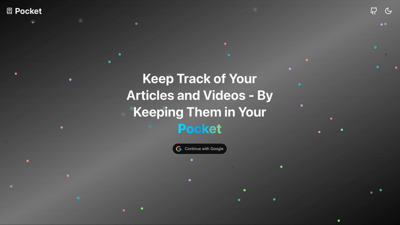

<div align="center">
   
</div>

---

<div align="center" >


)


</div>

<p style="font-size: 18px; text-align: center; max-width: 450px; margin:auto; margin-bottom: 12px">
Pocket is an open-source web app for organizing articles and videos you want to read or watch later. Save, categorize, and revisit your favorite content—all in one place.
</p>

<div align="center" >
  <div style="
    display: flex; 
    flex-direction: row; 
    gap: 8px; 
    justify-content: center"
  >
    <div style="position: relative; width: 50px">
      <div style="
        position: absolute;
        height: 15px; 
        width: 50px; 
        border-top: solid;
        border-left: solid;
        border-top-left-radius: 10px;
        border-width: 2px;
        top: 10px;
        "
      >
        <div
          style="
            width: 0;
            height: 0;
            border-left: 5px solid transparent;
            border-right: 5px solid transparent;
            border-top: 10px solid;
            position: absolute;
            bottom: -5px;
            left: -5.5px
          "
        ></div>
      </div>
    </div>
    <p>Click to try the demo</p>
    <div style="position: relative; width: 50px;">
      <div style="
        position: absolute;
        height: 15px; 
        width: 50px; 
        border-top: solid;
        border-right: solid;
        border-top-right-radius: 10px;
        border-width: 2px;
        top: 10px;
        "
      >
        <div
          style="
            width: 0;
            height: 0;
            border-left: 5px solid transparent;
            border-right: 5px solid transparent;
            border-top: 10px solid;
            position: absolute;
            bottom: -5px;
            right: -5.5px
          "
        ></div>
      </div>
    </div>
  </div>
  <div align="center">
    <a href="https://pocket-mauve.vercel.app/" target="_blank" >
      
    </a>
  </div>
</div>

## Table of Contents
- [Features](#features)
- [Installation](#installation)
- [License](#license)

## Features
- Advanced Organizer
- Advanced Filtering
- Easy Edits
- Blazingly Fast

## Installation

### Prerequisites

- [Node.js](https://nodejs.org/) **v22.17.0** (recommended)
- A package manager: [pnpm](https://pnpm.io/), [npm](https://www.npmjs.com/) or [yarn](https://yarnpkg.com/),

### Clone the repository

```bash
git clone https://github.com/anthonypiegaro/Pocket.git
cd Pocket
```

### Install dependencies

Using **pnpm**:
```bash
pnpm install
```

Using **npm**:
```bash
npm install
```

Using **yarn**:
```bash
yarn install
```

### Environment variables, API keys, and database
Pocket uses [Better-Auth](https://www.better-auth.com/) for the authentication. Most of the Better-Auth configuration will already be set up. There are only a few steps you'll need to get it up and running:

1. Set up Better-Auth environment variables
    - Follow step 2 in the docs for how to set these variables: [Better-Auth env](https://www.better-auth.com/docs/installation#set-environment-variables)
2. Choose one of the two options: (1) Use preconfigured Google OAuth or (2) configure your own authentication options
    1. Pocket is configured to use Google OAuth by default. To get started, you will need to create and add Google OAuth API keys. Follow only the first step in the [Better-Auth Guide](https://www.better-auth.com/docs/authentication/google#get-your-google-credentials). Save the redirect uri from your Google here as well. After you save your keys, add them as environment variables:

        ```
        GOOGLE_CLIENT_ID=your-google-client-id
        GOOGLE_CLIENT_SECRET=your-google-client-secret
        GOOGLE_REDIRECT_URI=your-application-domain/api/auth/callback/google
        ```

    2. If you prefer not to use the preconfigured authentication methods, you can customize yourself. Refer to the [Better-Auth Authentication Section](https://www.better-auth.com/docs/authentication/email-password).

Pocket uses [Drizzle](https://orm.drizzle.team/docs/overview) for the ORM layer and PostgreSQL for the database. Use the [Drizzle Guides](https://orm.drizzle.team/docs/get-started) to set up your preferred PostgreSQL provider.

### Start
To start, run
```bash
# Using pnpm
pnpm run dev

# Using npm
npm run dev

# Using yarn
yarn dev
```

## License
This project is licensed under the [MIT License](LICENSE).
